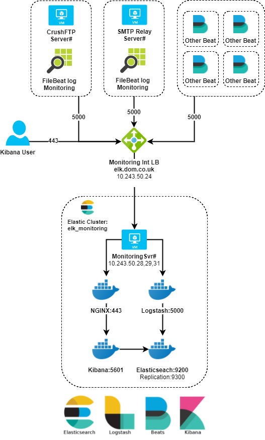

# Monitoring & Analytics with Elasticsearch
This example Docker Compose configuration demonstrates many components of the
Elastic Stack, all running on a single machine under Docker. The Terraform templates will deploy a cluster of 3 Azure VMs behind an internal loadbalancer all serve the same ELK and NGINX services to cater for potential low latency traffic from various Elastic Beats.
[`Cloned from Stack-Docker`](https://github.com/elastic/stack-docker)

## Branches
* `Master:` Used for Production cluster (synced with Puppet Production branch)
* `Development:` Synced with Puppet R10k Development branch

## References:
* [Official Docker Images](https://www.docker.elastic.co/)
* [Official Elastic-Docker Documentation](https://www.elastic.co/guide/en/elasticsearch/reference/current/docker.html)

## Prerequisites
- Docker and Docker Compose.
  * Windows and Mac users get Compose installed automatically
with Docker for Windows/Mac.

  * Linux users can read the [install instructions](https://docs.docker.com/compose/install/#install-compose) or can install via pip:
```
pip install docker-compose
```
> :bulb: For Debian based Linux machines the majority of this work is completed via the r10k Puppet manifest [`config/puppet/monitoring.pp`](config/puppet/monitoring.pp) where you can specify the elastic version. This repo will then be automatically cloned to `/media/data/elk.docker.nginx` on each member of the cluster.

* Windows Users must set the following 2 ENV vars:
  * `COMPOSE_CONVERT_WINDOWS_PATHS=1`
  * `PWD=/path/to/checkout/for/stack-docker`
    * for example I use the path: `/c/Users/nick/elastic/stack-docker`
    * Note: you're paths must be in the form of `/c/path/to/place` using `C:\path\to\place` will not work
  * You can set these two ways:
    1. Temporarily add an env var in powershell use: `$Env:COMPOSE_CONVERT_WINDOWS_PATHS=1`
    2. Permanently add an env var in powershell use: `[Environment]::SetEnvironmentVariable("COMPOSE_CONVERT_WINDOWS_PATHS", "1", "Machine")`
      > Note: you will need to refresh or create a new powershell for this env var to take effect
    3. in System Properties add the environment variables.

- At least 4GiB of RAM for the containers. Windows and Mac users _must_
configure their Docker virtual machine to have more than the default 2 GiB of
RAM:


* Linux Users must set the following configuration as `root`:

```
sysctl -w vm.max_map_count=262144
```
By default, the amount of Virtual Memory [is not enough](https://www.elastic.co/guide/en/elasticsearch/reference/current/vm-max-map-count.html).


## Starting the stack
Run `docker-compose up -d` to create an Elastic Stack cluster member with
Elasticsearch, Kibana, Logstash and NGINX frontend. Ensure the IP Adress of the new node is added to the `.env` file via the Puppet Monitoring profile above, this should update all nodes within the cluster.

Navigate to [`https://elk.dom.co.uk`](https://elk.dom.co.uk)

## Azure Topology



## TODO
- [ ] Convert docker_compose to [puppet containers](https://forge.puppet.com/puppetlabs/docker#containers) on the **r10k profile**
- [ ] Fix Puppet-Docker-compose [version 3 issues](https://github.com/puppetlabs/puppetlabs-docker/issues/94) with custom puppet facts (EPP)


### Notes
```
GENERATING CERTS
----------------
openssl req -x509 -nodes -newkey rsa:2048 -keyout config/logstash/logstash-forwarder.key -out config/logstash/logstash-forwarder.crt
cd config/certs
/usr/share/elasticsearch/bin/x-pack/certgen --cert <ROOT_CA_CERT>.crt --key <YOUR_CERT_KEY>.key -in instances.yml
```